# arr-llm-release-picker

> **⚠️ On hold — waiting for upstream integration**
>
> The Sonarr/Radarr forks that this webhook was designed for are being deprecated in favor of a proper upstream implementation. The webhook contract will change.
>
> Don't set this up for now — I'll update the repo once the new hook format is finalized. If upstream integration doesn't happen, I'll rebuild against the new design.
>
> Follow progress on [Sonarr #8396](https://github.com/Sonarr/Sonarr/issues/8396) and [Radarr #11372](https://github.com/Radarr/Radarr/issues/11372).

**Let an LLM choose your media releases instead of tweaking Custom Formats forever.**

Works with [Radarr](https://github.com/AlexMasson/Radarr) (movies) and [Sonarr](https://github.com/AlexMasson/Sonarr) (TV shows) to intelligently select releases based on natural language criteria like:

> "Pick 4K HDR if available with good seeders, prefer Atmos audio, avoid YIFY, keep it under 25GB"

## How It Works

Uses the **Download Decision Override** webhook in the [Radarr fork](https://github.com/AlexMasson/Radarr) and [Sonarr fork](https://github.com/AlexMasson/Sonarr):

```mermaid
sequenceDiagram
    participant Arr as Radarr / Sonarr<br>(fork)
    participant Picker as arr-llm-release-picker
    participant LLM as LLM API

    Arr->>Picker: POST /hook/{radarr,sonarr}/override<br>all candidate releases
    Picker->>LLM: system prompt + formatted release list
    LLM-->>Picker: {"choice": 3, "reason": "..."}
    Picker-->>Arr: {"selectedReleaseGuid": "..."}
    Note over Arr: Downloads selected release

    rect rgb(60, 60, 60)
        Note over Arr,Picker: If webhook fails or times out →<br>Arr uses its default selection
    end
```



**Key properties:**

- **Pre-grab**: The decision happens *before* the download starts — no cancelling grabs after the fact
- **Opt-in per profile**: AI is enabled per quality profile. No prompts = the arr chooses normally
- **Fail-safe**: If the webhook fails, times out, or returns garbage — the arr falls back to its default pick
- **Any LLM**: Works with any OpenAI-compatible API (OpenAI, local llama.cpp, Ollama, etc.)

## Quick Start

### 1. Docker Compose

```yaml
services:
  arr-llm-release-picker:
    image: ghcr.io/alexmasson/arr-llm-release-picker:latest
    container_name: arr-llm-release-picker
    environment:
      # At least one arr required
      - RADARR_URL=http://radarr:7878
      - RADARR_API_KEY=your_radarr_api_key
      - SONARR_URL=http://sonarr:8989
      - SONARR_API_KEY=your_sonarr_api_key
      # LLM (any OpenAI-compatible endpoint)
      - LLM_API_URL=https://api.openai.com/v1
      - LLM_API_KEY=sk-...
      - LLM_MODEL=gpt-4o
      # Optional
      - LLM_TIMEOUT=90
      - NTFY_URL=https://ntfy.sh
      - NTFY_TOPIC=arr-llm-release-picker
      - SKIP_TAG=no-ai
    volumes:
      - ./prompts:/config/prompts
    ports:
      - "8080:8080"
    restart: unless-stopped
```

### 2. Create prompts

```
./prompts/
├── radarr/
│   └── hd-1080p/
│       └── system.txt       ← AI enabled for Radarr "HD-1080p" profile
└── sonarr/
    └── hd-1080p/
        └── system.txt       ← AI enabled for Sonarr "HD-1080p" profile
```

Only profiles with a matching folder get AI selection. Everything else passes through unchanged.

### 3. Configure the arr

In **Settings → Download Clients → Download Decision Override**:
- Enable: ✅
- URL: `http://arr-llm-release-picker:8080/hook/radarr/override` (or `.../sonarr/...`)
- Timeout: `30` seconds

> Requires the [Radarr fork](https://github.com/AlexMasson/Radarr) (`ghcr.io/alexmasson/radarr:latest`) or [Sonarr fork](https://github.com/AlexMasson/Sonarr) (`ghcr.io/alexmasson/sonarr:latest`). Both are based on their respective stable branches with a single-commit diff.

## Prompts

AI selection is **per service and per quality profile**. Profile matching is case-insensitive (`"Ultra-HD"` → `ultra-hd/`).

### Directory structure

```
./prompts/                        # Mount to /config/prompts
├── radarr/                       # Movie prompts
│   ├── hd-1080p/system.txt       # → Radarr "HD-1080p" profile
│   └── ultra-hd/system.txt       # → Radarr "Ultra-HD" profile
└── sonarr/                       # TV show prompts
    ├── hd-1080p/system.txt       # → Sonarr "HD-1080p" profile
    └── ultra-hd/system.txt       # → Sonarr "Ultra-HD" profile
```

Movies and TV shows have separate prompts because they have different considerations (single file vs season packs, remux preferences, episode count vs quality tradeoffs).

### Example system.txt

```
You are a media release selector. Pick the best release based on:

CRITERIA:
1. Prefer releases with high seeders (>10)
2. MULTI (VF + VO) preferred for French dubs
3. x265/HEVC for smaller file sizes
4. Avoid low-quality groups (YIFY, etc.)
5. Target size: 4-12 GB for 1080p, 15-40 GB for 4K

RESPONSE FORMAT (JSON only, no markdown):
{"choice": <number>, "reason": "<brief reason>"}
```

The user prompt is auto-generated with the movie/series title, quality profile name, and a formatted table of all candidate releases (title, size, seeders, quality, languages, custom formats, etc.).

## Environment Variables

| Variable | Required | Default | Description |
|----------|----------|---------|-------------|
| `LLM_API_URL` | **Yes** | — | OpenAI-compatible API endpoint |
| `LLM_MODEL` | **Yes** | — | Model name (`gpt-4o`, `gpt-4.1`, etc.) |
| `LLM_API_KEY` | No | — | API key (optional for local LLMs) |
| `LLM_TIMEOUT` | No | `90` | LLM request timeout in seconds |
| `RADARR_URL` | No* | — | Radarr base URL |
| `RADARR_API_KEY` | No* | — | Radarr API key |
| `SONARR_URL` | No* | — | Sonarr base URL |
| `SONARR_API_KEY` | No* | — | Sonarr API key |
| `SKIP_TAG` | No | `no-ai` | Tag name to bypass AI for a movie/series |
| `DRY_RUN` | No | `false` | Log AI decisions without selecting |
| `NTFY_URL` | No | — | ntfy server URL for notifications |
| `NTFY_TOPIC` | No | `arr-llm-release-picker` | ntfy topic |
| `PROMPTS_DIR` | No | `/config/prompts` | Prompts directory path |

> \* At least one arr (Radarr or Sonarr) must be configured with both URL and API key.

## API Endpoints

| Endpoint | Method | Description |
|----------|--------|-------------|
| `/health` | GET | Health check |
| `/test` | GET | Test Radarr/Sonarr/LLM connections + show configured profiles |
| `/reload` | POST | Reload prompts from disk (no restart needed) |
| `/hook/radarr/override` | POST | Radarr Download Decision Override webhook |
| `/hook/sonarr/override` | POST | Sonarr Download Decision Override webhook |
| `/simulate/radarr/<movie_id>` | GET | Dry-run AI selection for a movie (by Radarr ID) |
| `/simulate/sonarr/<series_id>` | GET | Dry-run AI selection for a series (by Sonarr ID) |

## Notifications

When configured with `NTFY_URL`, notifications are sent:
- **On AI override** — when the LLM picks a different release than the arr's default
- **On failure** — when the LLM fails to make a valid selection

No notification is sent when the AI confirms the arr's default pick (to avoid noise).

## Skip Tag

Tag a movie or series with the skip tag (default: `no-ai`) in Radarr/Sonarr to bypass AI selection for that item, regardless of its quality profile. Useful for items where you want manual control.

## Related Projects

- **[AlexMasson/Radarr](https://github.com/AlexMasson/Radarr)** — Radarr fork with Download Decision Override (stable, `ghcr.io/alexmasson/radarr:latest`)
- **[AlexMasson/Sonarr](https://github.com/AlexMasson/Sonarr)** — Sonarr fork with Download Decision Override (stable v4, `ghcr.io/alexmasson/sonarr:latest`)

## License

MIT
